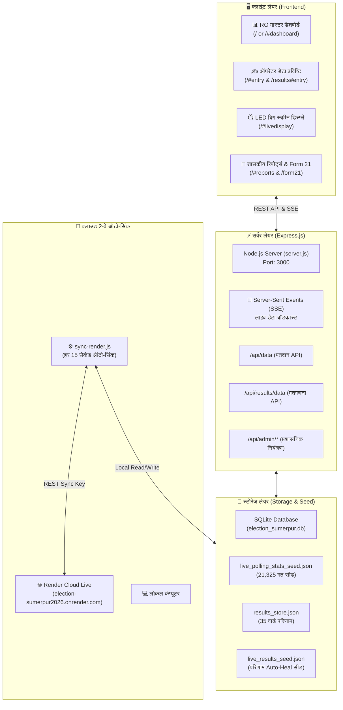

# 🏛️ सुमेरपुर नगर पालिका आम चुनाव 2026 — सम्पूर्ण प्रोजेक्ट रूपरेखा एवं संचालन गाइड
> **कार्यालय रिटर्निंग ऑफिसर (उपखण्ड मजिस्ट्रेट), सुमेरपुर (जिला पाली, राजस्थान)**  
> *यह दस्तावेज इस पूरे सिस्टम की तकनीकी संरचना, कार्यप्रणाली और भविष्य में पुनः उपयोग (Future Reusability) हेतु तैयार किया गया आधिकारिक ब्लूप्रिंट है।*

---

## 📑 विषय-सूची (Table of Contents)
1. [प्रोजेक्ट का परिचय एवं उद्देश्य](#1-प्रोजेक्ट-का-परिचय-एवं-उद्देश्य)
2. [सिस्टम आर्किटेक्चर एवं वर्कफ़्लो](#2-सिस्टम-आर्किटेक्चर-एवं-वर्कफ़्लो)
3. [मुख्य मॉड्यूल्स की कार्यप्रणाली](#3-मुख्य-मॉड्यूल्स-की-कार्यप्रणाली)
   - 3.1 [मतदान नियंत्रण कक्ष पोर्टल (Polling Day Module)](#31-मतदान-नियंत्रण-कक्ष-पोर्टल-polling-day-module)
   - 3.2 [मतगणना एवं परिणाम पोर्टल (Counting & Results Module)](#32-मतगणना-एवं-परिणाम-पोर्टल-counting--results-module)
4. [डेटा स्टोरेज एवं सुरक्षा प्रणाली (Storage & Auto-Heal)](#4-डेटा-स्टोरेज-एवं-सुरक्षा-प्रणाली-storage--auto-heal)
5. [2-वे क्लाउड ऑटो-सिंक इंजन (Render Cloud ↔ Local PC)](#5-2-वे-क्लाउड-ऑटो-सिंक-इंजन-render-cloud--local-pc)
6. [फ़ोल्डर एवं फाइल संरचना (Directory Structure)](#6-फ़ोल्डर-एवं-फाइल-संरचना-directory-structure)
7. [पोर्टल को शुरू एवं संचालित कैसे करें (How to Run & Operate)](#7-पोर्टल-को-शुरू-एवं-संचालित-कैसे-करें-how-to-run--operate)
8. [भविष्य के किसी नए चुनाव हेतु पुनः उपयोग कैसे करें (Future Election Guide)](#8-भविष्य-के-किसी-नए-चुनाव-हेतु-पुनः-उपयोग-कैसे-करें-future-election-guide)
9. [समस्या निवारण (Troubleshooting & FAQs)](#9-समस्या-निवारण-troubleshooting--faqs)

---

## 1. प्रोजेक्ट का परिचय एवं उद्देश्य

यह एक **फुल-स्टैक, मल्टी-यूज़र, रियल-टाइम इलेक्शन मैनेजमेंट पोर्टल** है जिसे स्थानीय निकाय (नगर पालिका/नगर परिषद) चुनावों के दो सबसे महत्वपूर्ण चरणों के लिए विकसित किया गया है:
1. **मतदान दिवस (Polling Day):** मतदान केंद्रों (बूथों) से प्रति दो घंटे के अंतराल पर लाइव मतदान प्रतिशत, पुरुष-महिला-थर्ड जेंडर मतदान, कतार स्थिति और शासकीय रिपोर्ट्स का संकलन।
2. **मतगणना दिवस (Counting Day):** चक्रवार (Round-wise) EVM एवं डाक मतपत्रों की प्रविष्टि, लाइव अंतर (Margin) विश्लेषण, दलगत स्थिति (Party Tally), प्ररूप 20 एवं प्ररूप 21 (निर्वाचन प्रमाण-पत्र) का स्वतः जनरेशन।

---

## 2. सिस्टम आर्किटेक्चर एवं वर्कफ़्लो



---

## 3. मुख्य मॉड्यूल्स की कार्यप्रणाली

### 3.1 मतदान नियंत्रण कक्ष पोर्टल (Polling Day Module)
- **मुख्य पेज:** `public/index.html` (रूट URL: `http://localhost:3000/`)
- **बूथ कवरेज:** 35 वार्डों के 36 मतदान केंद्र (वार्ड 26 निर्विरोध होने से बूथ 27 पर मतदान नहीं)।
- **6 जोनल मजिस्ट्रेट क्षेत्र:** सभी 36 बूथ 6 सुपरवाइज़री ज़ोन में विभाजित हैं।
- **प्रमुख विशेषताएं:**
  - **टाइम-स्लॉट लॉकिंग:** ऑपरेटर केवल निर्धारित समय स्लॉट (10 AM, 1 PM, 3 PM, 5/6 PM) में ही डेटा दर्ज कर सकते हैं। समय बीतने के बाद केवल RO पासवर्ड से ओवरराइड संभव है।
  - **स्वतः मिलान (Validation):** दर्ज किए गए मत कुल पंजीकृत मतदाताओं (Electors) से अधिक नहीं हो सकते।
  - **क्लिक-टू-कॉल निर्देशिका:** जोनल मजिस्ट्रेट और प्रगणकों के मोबाइल नंबर पर सीधे क्लिक करके कॉल करने की सुविधा।
  - **1-क्लिक शासकीय PDF जनरेटर:** किसी भी स्लॉट (जैसे 1 PM या 5 PM) की प्रमाणित शासकीय रिपोर्ट मय RO हस्ताक्षर ब्लॉक तैयार होती है।

---

### 3.2 मतगणना एवं परिणाम पोर्टल (Counting & Results Module)
- **मुख्य पेज:** `public/results.html` (URL: `http://localhost:3000/results`)
- **अंतिम परिणाम पत्रक:** `public/form21.html` (URL: `http://localhost:3000/form21`)
- **प्रमुख विशेषताएं:**
  - **चक्रवार (Round-wise) EVM प्रविष्टि:** यदि किसी वार्ड में 2 मतदान केंद्र हैं, तो पार्ट 1 और पार्ट 2 की अलग-अलग EVM मत प्रविष्टि।
  - **डाक मतपत्र एवं NOTA:** डाक मतों एवं नोटा को जोड़कर कुल योग की गणना।
  - **लाइव मत मिलान (Reconciliation):** 11-09 मतदान दिवस पर पोल हुए मतों (21,325) से गिने गए मतों का 100% सटीक मिलान।
  - **जादुई आंकड़ा (Majority Meter):** कुल 35 सीटों में से 18 सीटों के बहुमत मार्कर के साथ लाइव प्रोग्रेस बार।
  - **प्ररूप 21 (Certificate of Election):** विजेता घोषित होते ही निर्वाचन आयोग के वैधानिक प्रारूप में स्वतः प्रमाण-पत्र तैयार होता है।

---

## 4. डेटा स्टोरेज एवं सुरक्षा प्रणाली (Storage & Auto-Heal)

इस प्रोजेक्ट में डेटा सुरक्षा के लिए **हाइब्रिड आर्किटेक्चर** का उपयोग किया गया है:

| डेटा प्रकार | मुख्य स्टोरेज | सुरक्षा बैकअप फाइल | Auto-Heal कार्यप्रणाली |
| :--- | :--- | :--- | :--- |
| **मतदान डेटा (Polling)** | SQLite DB (`polling_stats` टेबल) | `live_polling_stats_seed.json` | यदि सर्वर चालू होने पर कुल वोट 0 मिलें, तो यह फाइल तुरंत 21,325 वोटों को डेटाबेस में पुनः भर देती है। |
| **मतगणना डेटा (Results)** | JSON स्टोर (`results_store.json`) | `live_results_seed.json` | यदि क्लाउड रीस्टार्ट से रिजल्ट्स 0 हो जाएं, तो `getResultsStore()` स्वतः सीड से 35 वार्डों का घोषित परिणाम लोड कर लेता है। |
| **ऑडिट लॉग्स** | SQLite DB (`audit_logs` टेबल) | `live_logs_backup.json` | किस ऑपरेटर ने किस समय कौन सा डेटा बदला, इसका पूरा आईपी व टाइमस्टैम्प लॉग। |

---

## 5. 2-वे क्लाउड ऑटो-सिंक इंजन (Render Cloud ↔ Local PC)

Render का Free-Tier सर्वर 15 मिनट इनएक्टिव रहने पर सो जाता है और रीस्टार्ट पर अस्थायी फाइलों को मिटा देता है। इस समस्या को खत्म करने के लिए **`sync-render.js`** इंजन विकसित किया गया है:

1. **हर 15 सेकंड में ऑटो-जांच:** यह इंजन हर 15 सेकंड में Render क्लाउड और लोकल कंप्यूटर के डेटा की तुलना करता है।
2. **डाउनलोड (Cloud → Local PC):** यदि Render पर किसी ऑपरेटर ने नया वोट डाला, तो यह उसे तुरंत लोकल कंप्यूटर और `backups/` में सुरक्षित कर लेता है।
3. **ऑटो-हील रीस्टोर (Local PC → Cloud):** यदि Render सर्वर रीस्टार्ट होने के कारण 0 वोट दिखाता है, तो यह इंजन पहचानकर तुरंत लोकल PC का पूरा डेटा Render पर अपलोड कर देता है।

---

## 6. फ़ोल्डर एवं फाइल संरचना (Directory Structure)

```text
ELECTION/
│
├── START_SERVER.bat              # रूट सर्वर लॉन्चर
├── START_AUTO_SYNC.bat           # रूट क्लाउड ऑटो-सिंक लॉन्चर
├── PUSH_TO_LIVE.bat              # रूट से GitHub/Render पर डिप्लॉय करने का बैट
├── package.json                  # रूट डिपेंडेंसी व फॉरवर्डिंग स्क्रिप्ट्स
├── render.yaml                   # Render क्लाउड डिप्लॉयमेंट कॉन्फिगरेशन
│
└── NP_Election_2026/             # 📁 मुख्य प्रोजेक्ट फोल्डर
    ├── PROJECT_BLUEPRINT_MANUAL.md # 📖 सम्पूर्ण प्रोजेक्ट मैनुअल (यह फाइल)
    ├── server.js                 # मुख्य एक्सप्रेस सर्वर (Port: 3000)
    ├── database.js               # SQLite डेटाबेस कनेक्शन व इनिशियलाइजेशन
    ├── candidates_master.js      # 35 वार्डों के सभी प्रत्याशियों का आधिकारिक मास्टर डेटा
    ├── runner.js                 # सर्वर व क्लाउड टनल (LocalTunnel) लॉन्चर
    ├── sync-render.js            # 2-वे क्लाउड ऑटो-सिंक इंजन
    │
    ├── election_sumerpur.db      # मुख्य SQLite डेटाबेस (मतदान, यूज़र्स, बूथ)
    ├── results_store.json        # सक्रिय मतगणना परिणाम डेटा
    ├── live_polling_stats_seed.json # मतदान Auto-Heal सीड (21,325 वोट)
    ├── live_results_seed.json    # मतगणना Auto-Heal सीड (35 वार्ड परिणाम)
    │
    ├── START_SERVER.bat          # लोकल सर्वर शुरू करने की बैच फाइल
    ├── START_AUTO_SYNC.bat       # क्लाउड सिंक शुरू करने की बैच फाइल
    ├── PUSH_TO_LIVE.bat          # GitHub पर कमिट व पुश करने की बैच फाइल
    │
    ├── public/                   # 🌐 वेब फ्रंटएंड फाइल्स
    │   ├── index.html            # मतदान नियंत्रण कक्ष पोर्टल
    │   ├── results.html          # मतगणना एवं परिणाम पोर्टल
    │   ├── form21.html           # प्ररूप 21 निर्वाचन प्रमाण-पत्र
    │   ├── css/style.css         # आधुनिक शासकीय डिज़ाइन स्टाइलशीट
    │   └── js/
    │       ├── app.js            # मतदान पोर्टल का क्लाइंट लॉजिक
    │       └── results.js        # मतगणना पोर्टल का क्लाइंट लॉजिक
    │
    └── backups/                  # 💾 ऑटोमैटिक बैकअप डायरेक्टरी
        ├── backup_latest.json
        └── results_backup_official_20260914.json
```

---

## 7. पोर्टल को शुरू एवं संचालित कैसे करें (How to Run & Operate)

### परिदृश्य A: केवल अपने कंप्यूटर (Local PC) पर चलाना
1. फोल्डर में मौजूद **`START_SERVER.bat`** पर डबल-क्लिक करें।
2. ब्लैक विंडो खुलेगी और संदेश दिखेगा: `लोकल सर्वर: http://localhost:3000`।
3. ब्राउज़र में खोलें:
   - मतदान पोर्टल: 👉 **`http://localhost:3000`**
   - मतगणना पोर्टल: 👉 **`http://localhost:3000/results`**

### परिदृश्य B: कंट्रोल रूम में कई कंप्यूटर/मोबाइल कनेक्ट करना
1. सर्वर शुरू करने पर टर्मिनल पर आपका लोकल IP पता दिखेगा (उदा. `http://192.168.1.45:3000`)।
2. सभी ऑपरेटरों के लैपटॉप/मोबाइल को उसी Wi-Fi से जोड़ें।
3. वे अपने ब्राउज़र में वह IP पता खोलकर सीधे लॉगिन कर सकते हैं।

### परिदृश्य C: इंटरनेट (Render क्लाउड) के साथ लाइव चलाना
1. इंटरनेट पर वेबसाइट: `https://election-sumerpur2026.onrender.com`
2. अपने कंप्यूटर पर **`START_AUTO_SYNC.bat`** चालू रखें।
3. यह आपके कंप्यूटर और Render क्लाउड के बीच लगातार डेटा सुरक्षित रखेगा।
4. जब भी आप कोड में कोई बदलाव करें, **`PUSH_TO_LIVE.bat`** पर डबल-क्लिक करें; कोड स्वतः GitHub और Render पर अपडेट हो जाएगा।

---

## 8. भविष्य के किसी नए चुनाव हेतु पुनः उपयोग कैसे करें (Future Election Guide)

यदि आपको भविष्य में किसी अन्य नगर पालिका (उदा. पाली, सोजत, सादड़ी) या 2031 के चुनाव के लिए इस पोर्टल का उपयोग करना हो, तो आपको केवल निम्न 3 फाइल्स बदलनी होंगी:

### चरण 1: प्रत्याशियों की सूची बदलना ([`candidates_master.js`](file:///c:/Users/hetan/OneDrive/Desktop/ELECTION-new/ELECTION/ELECTION/NP_Election_2026/candidates_master.js))
- इसमें प्रत्येक वार्ड के प्रत्याशियों के नाम, दल, चुनाव प्रतीक, लिंग और पिता का नाम दिए गए हैं।
- नए चुनाव के प्रत्याशियों की जानकारी इस फाइल में अपडेट करें।

### चरण 2: बूथ एवं मतदाताओं की संख्या बदलना ([`database.js`](file:///c:/Users/hetan/OneDrive/Desktop/ELECTION-new/ELECTION/ELECTION/NP_Election_2026/database.js))
- `masterBooths` ऐरे में नए चुनाव के वार्ड, बूथ संख्या, बूथ का नाम और मतदाताओं की संख्या (Electors) अपडेट करें।
- यदि कोई वार्ड निर्विरोध है, तो `isNirvirodh: true` सेट करें।

### चरण 3: डेटा को क्लीन (0 वोट) रीसेट करना
- `results_store.json` में `results_store_clean_initial.json` की सामग्री कॉपी करें।
- `election_sumerpur.db` को हटा दें; सर्वर चालू होते ही नई साफ डेटाबेस फाइल अपने आप बन जाएगी।

---

## 9. समस्या निवारण (Troubleshooting & FAQs)

| समस्या | कारण | समाधान |
| :--- | :--- | :--- |
| **पोर्टल पर 0 वोट दिख रहे हैं** | Render सर्वर रीस्टार्ट हुआ है। | अपने कंप्यूटर पर `START_AUTO_SYNC.bat` चलाएं या 1 मिनट प्रतीक्षा करें, Auto-Heal स्वतः डेटा बहाल कर देगा। |
| **पोर्ट 3000 व्यस्त (Port in use) बता रहा है** | पुराना Node.js बैकग्राउंड में चल रहा है। | टास्क मैनेजर से `node.exe` को एंड टास्क करें या कंप्यूटर रीस्टार्ट करें। |
| **मोबाइल से पोर्टल नहीं खुल रहा** | मोबाइल और लैपटॉप अलग-अलग वाई-फाई पर हैं। | दोनों को एक ही वाई-फाई/हॉटस्पॉट से जोड़ें और लैपटॉप के फ़ायरवॉल में पोर्ट 3000 अलाउ करें। |
| **Render पर कोड अपडेट नहीं हो रहा** | Git क्रेडेंशियल या पुश पेंडिंग है। | `PUSH_TO_LIVE.bat` चलाएं और सुनिश्चित करें कि कमिट सफलतापूर्वक पुश हुआ है। |

---
*दस्तावेज संकलन: कंट्रोल रूम तकनीकी टीम | नगर पालिका चुनाव 2026*
