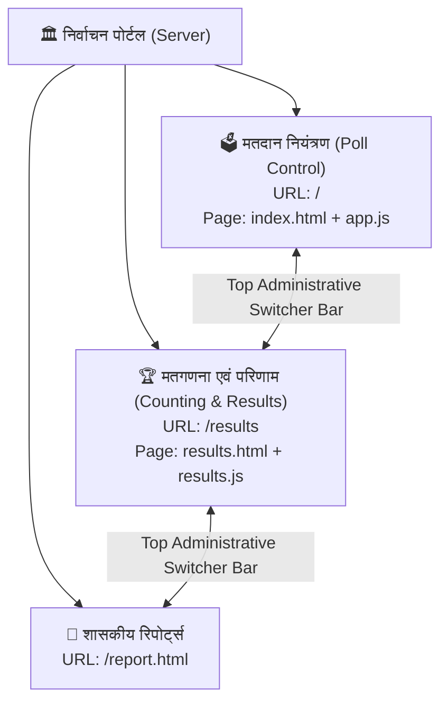

# 🏛️ सुमेरपुर चुनाव 2026 पोर्टल — डेटा वैलिडेशन एवं ऑटो-लॉकिंग अपडेट्स

ऑपरेटर डेटा एंट्री को 100% त्रुटि-रहित बनाने के लिए आपके द्वारा बताए गए सभी 3 तकनीकी नियमों और संदेशों को सफलतापूर्वक लागू कर दिया गया है:

---

## 1. लागू किए गए नए तकनीकी नियम (Rules Implemented)

### 🔒 नियम 1: मॉक पोल एवं 7:15 AM मतदान प्रारंभ की पूर्व-शर्त (Prerequisite Lock)
- **विवरण**: जब तक ऑपरेटर किसी बूथ के लिए **'मॉक पोल'** और **'07:15 AM मतदान प्रारंभ'** दोनों को **'Yes'** नहीं करता, तब तक उस बूथ के आगे के सभी स्लॉट (`10:00 AM`, `01:00 PM`, `03:00 PM`, `06:00 PM`, `6 PM कतार`, `अंतिम मतदान`) लॉक रहेंगे।
- **UI प्रभाव**: इनपुट बॉक्स पर धारीदार बॉर्डर (`input-locked-mock`) और कर्सर पर *Not Allowed* का निशान दिखेगा तथा टूलटिप पर *"जब तक मॉक पोल और 07:15 प्रारंभ दोनों Yes नहीं होते, यह स्लॉट लॉक रहेगा"* लिखा आएगा।
- दोनों के 'Yes' होते ही संबंधित समय-स्लॉट अनलॉक हो जाते हैं।

---

### 🛑 नियम 2: कुल मतदाता सीमा (Total Electors Ceiling Limit)
- **विवरण**: किसी भी स्लॉट (10 AM, 1 PM, 3 PM, 6 PM, 6 PM कतार तथा अंतिम मतदान) का मान उस बूथ के **कुल पंजीकृत मतदाताओं (Total Electors)** से अधिक नहीं हो सकता।
- **सुरक्षा**:
  - ऑपरेटर के टाइप करते ही यदि मान कुल मतदाताओं से अधिक होगा तो इनपुट तुरंत **लाल (Red Border & Soft Glow)** हो जाएगा।
  - सेव करने पर स्पष्ट चेतावनी संदेश खुलेगा:
    > `⚠️ बूथ सं. [X]: अंतिम कुल मतदान ([संख्या]) बूथ के कुल मतदाताओं ([कुल]) से अधिक नहीं हो सकता!`

---

### 📈 नियम 3: संचयी मतदान मान में वृद्धि नियम (Monotonic Progression Validation)
- **विवरण**: मतदान संचयी (Cumulative) होता है, इसलिए बाद वाले स्लॉट का मतदान पिछले स्लॉट के मतदान से **कम नहीं हो सकता (बराबर या अधिक ही हो सकता है)**।
  $$\text{10 AM} \le \text{01 PM} \le \text{03 PM} \le \text{06 PM} \le \text{Final Votes}$$
- **उदाहरण**:
  - यदि 10:00 AM पर `200` वोट भरे गए हैं, तो 01:00 PM में `199` नहीं भरा जा सकता (`200` या उससे अधिक ही स्वीकार्य होगा)।
- **ऑपरेटर संदेश (Alert Message)**:
  > `⚠️ बूथ सं. [X]: 01:00 PM (150) का मतदान पिछले स्लॉट 10:00 AM (200) से कम नहीं हो सकता! मतदान संचयी (Cumulative) होना चाहिए।`

---

## 2. सुरक्षा स्तर (Dual Layer Protection)

1. **क्लाइंट-साइड (Front-End - [`public/js/app.js`](file:///c:/Users/hetan/OneDrive/Desktop/ELECTION26/ELECTION/public/js/app.js))**:
   - `validateLiveBoothRow()`: टाइप करते समय ही ऑपरेटर को गलत एंट्री पर लाल रंग और टूलटिप से सचेत करता है।
   - `validateSingleBoothEntry()`: बूथ का 'सुरक्षित करें' बटन या 'ज़ोन के सभी बूथ सुरक्षित करें' दबाने पर तुरंत चेकिंग करके गलत इनपुट बॉक्स पर स्वतः फोकस करता है और हिंदी में स्पष्ट अलर्ट दिखाता है।
2. **सर्वर-साइड (Back-End - [`server.js`](file:///c:/Users/hetan/OneDrive/Desktop/ELECTION26/ELECTION/server.js))**:
   - `validateBoothStats()`: यदि कोई नेटवर्क स्क्रिप्ट या अन्य माध्यम से गलत डेटा भेजने का प्रयास करे, तो सर्वर HTTP 400 रिस्पॉन्स के साथ त्रुटि लौटाकर डेटाबेस की शुद्धता बनाए रखता है।

---

## 3. परीक्षण व सत्यापन (Testing & Verification)
- **ब्राउज़र टेस्ट**: ब्राउज़र सब-एजेंट द्वारा लाइव पोर्टल (`http://localhost:3000`) पर सिमुलेटर और डेटा एंट्री फॉर्म पर टेस्ट किया गया।
- अधिक वोटर डालने पर रेड बॉर्डर हाइलाइट और सेविंग ब्लॉक की पुष्टि की गई।
- सर्वर रीस्टार्ट कर नवीन कोड को सक्रिय कर दिया गया है।

---

## 4. वार्ड 1 मतदाता संख्या अद्यतन (Ward 1 Electors Count Update)
- **बूथ 1 (भाग 1 - रा.उ.प्रा.वि., संजय नगर)**: 851 मतदाता (अद्यतन)
- **बूथ 2 (भाग 2 - रा.व.उ. संस्कृत वि., संजय नगर)**: 960 मतदाता (अद्यतन)
- डेटाबेस (`election_sumerpur.db`) एवं मास्टर फाइल (`database.js`) दोनों में अद्यतन कर दिया गया है।

---

## 5. मोबाइल-फ्रेंडली रिस्पॉन्सिव डिज़ाइन (Mobile-Friendly Responsive Design)
- **डेस्कटॉप सुरक्षा**: कंप्यूटर/लैपटॉप (1024px+) पर लेआउट में कोई बदलाव नहीं (0% प्रभाव)।
- **स्मार्टफोन व टैबलेट अनुकूलन (<= 768px व <= 480px)**:
  - **स्टिकी बूथ कॉलम (Sticky Left Column)**: 14 कॉलम वाली टेबल में दाएँ-बाएँ स्वाइप करने पर भी **बूथ संख्या** हमेशा बाईं ओर फिक्स रहेगी।
  - **स्वाइप हिंट**: मोबाइल उपयोगकर्ताओं के लिए टेबल के ऊपर स्पष्ट स्वाइप गाइड।
  - **टच-फ्रेंडली इनपुट**: इनपुट फील्ड की ऊंचाई 38px और फॉन्ट 13.5px+ (ऑटो-ज़ूम रोकथाम)।
  - **2-कॉलम KPI ग्रिड**: मोबाइल स्क्रीन पर डैशबोर्ड कार्ड्स दो-कॉलम में साफ सुथरे समायोजित।
  - **फुल-विड्थ टच बटन**: 'ज़ोन के समस्त बूथों का डेटा एक साथ सुरक्षित करें' बटन मोबाइल पर पूरे विस्तार में आसान टैप के साथ।
  - **पॉपअप मोडल अनुकूलन**: लॉगिन व रिपोर्ट मोडल स्क्रीन के 95-96% पर बिना कटे खुलते हैं।

---

## 6. आधिकारिक निर्वाचन शब्दावली अद्यतन (Official Terminology Update)
- **पूर्व शब्द**: "6 PM कतार (Queue)"
- **नवीन आधिकारिक शब्द (विकल्प 1 लागू)**:
  - **डेटा एंट्री टेबल एवं बूथ मॉनिटरिंग ग्रिड**: **`6 PM कतारबद्ध`**
  - **शासकीय रिपोर्ट, PDF स्टूडियो एवं बुलेटिन ड्रॉपडाउन**: **`06:00 PM पर कतारबद्ध मतदाता रिपोर्ट`**
  - **डैशबोर्ड KPI स्ट्रिप**: **`6 PM कतारबद्ध (In Queue)`**
  - **CSV / एक्सेल एक्सपोर्ट हेडर**: **`06:00 PM कतारबद्ध`**
  - **ऑपरेटर वैलिडेशन व अलर्ट संदेश**: **`06:00 PM कतारबद्ध मतदाता`**

---

## 7. नेविगेशन बार व टैब नाम अद्यतन (Navigation Tabs Terminology)
- **ऑपरेटर डेटा एंट्री** ➔ **`मतदान प्रविष्टि`** (Voting / Poll Data Entry)
- **शासकीय PDF रिपोर्ट्स** ➔ **`रिपोर्ट्स`** (Reports)
- **कंट्रोल रूम LED डिस्प्ले** ➔ **`कंट्रोल रूम लाइव डिस्प्ले`** (Control Room Live Display)
- **लाइव डेटा एंट्री पत्रक** ➔ **`लाइव मतदान प्रविष्टि पत्रक`**

---

## 8. 📺 कंट्रोल रूम लाइव डिस्प्ले — फुल स्क्रीन एवं मतदान दिवस के उन्नत फीचर्स

1. **⛶ फुल स्क्रीन टॉगल (Full Screen Toggle)**:
   - हेडर में एक-क्लिक `⛶ फुल स्क्रीन (Full Screen)` बटन जोड़ा गया।
   - क्लिक करने पर ब्राउज़र का मेन्यू, टास्कबार और हेडर छिप जाता है और सिर्फ हाई-कंट्रास्ट डार्क LED डैशबोर्ड 100% स्क्रीन पर आ जाता है।
   - कीबोर्ड का `Esc` दबाने या `✖ सामान्य स्क्रीन (Exit)` बटन दबाने पर सामान्य व्यू में स्वतः वापसी।

2. **📈 समय स्लॉट मतदान प्रगति (Hourly Poll Turnout Trend Timeline)**:
   - सभी समय-स्लॉट्स (07:05 AM मॉक, 07:15 AM प्रारंभ, 10 AM, 1 PM, 3 PM, 6 PM, 6 PM कतारबद्ध, अंतिम क्लोजिंग) का लाइव तुलनात्मक कार्ड ग्रिड।
   - वर्तमान सक्रिय समय-स्लॉट कार्ड पर ऑटोमैटिक नीला ग्लो (`active-slot`)।

3. **🚨 वर्तमान स्लॉट रिपोर्टिंग स्थिति व लंबित बूथ अलर्ट (Pending Booths Alert)**:
   - वर्तमान स्लॉट में कितने बूथों का डेटा आ चुका है (उदा. `35/35 पूर्ण` अथवा `32/35 रिपोर्टेड, 3 प्रतीक्षारत`)।
   - जिन बूथों का डेटा लंबित है, उनके बूथ नंबर लाल/पीले रंग में स्पष्ट दिखते हैं ताकि RO/कंट्रोल रूम तुरंत जोनल मजिस्ट्रेट को सूचित कर सके।

4. **🗺️ समस्त 35 मतदान केंद्रों की लाइव हीटमैप मैट्रिक्स (35 Booths Live Heatmap)**:
   - सभी 35 सक्रिय मतदान केंद्रों (+ 1 निर्विरोध वार्ड 26) का एक-नज़र रंग-कोडित ग्रिड:
     - 🟢 **हरा (Green)**: 60%+ मतदान (उत्कृष्ट)
     - 🟡 **पीला (Yellow)**: 40-59.9% मतदान (सामान्य)
     - 🔴 **लाल (Red Alert)**: 40% से कम मतदान (सुस्त मतदान - विशेष प्रशासनिक निगरानी)
     - 🟣 **बैंगनी (Purple)**: निर्विरोध वार्ड 26

5. **📢 लाइव ब्रेकिंग न्यूज़ टिकर (Large High-Visibility Running News Ticker)**:
   - स्क्रीन के नीचे वास्तविक समय में बड़े व स्पष्ट अक्षरों (18.5px बोल्ड, 2px रॉयल ब्लू बॉर्डर और लाल बैज) में स्क्रोल होने वाला लाइव सूचना बुलेटिन।
   - दूर से और बड़ी LED/प्रोजेक्टर स्क्रीन पर भी आसानी से पढ़ने योग्य।
   - यूज़र निर्देशानुसार हेल्पलाइन नंबर हटा दिए गए हैं और केवल चुनाव की वास्तविक लाइव स्थिति प्रदर्शित होती है।

---

## 9. 📄 मास्टर रिपोर्ट (Comprehensive Master Report) से 'कतारबद्ध' कॉलम हटाना
- **मास्टर रिपोर्ट (`report.html?slot=ALL`)**:
  - '6 PM कतारबद्ध' कॉलम को हेडर, सभी 36 बूथों की डेटा रो, निर्विरोध पंक्ति तथा कुल महायोग फुटर से हटा दिया गया है।
  - अब मास्टर रिपोर्ट में स्वच्छ व मानक 11 कॉलम हैं:
    $$\text{बूथ} \;\mid\; \text{जोन} \;\mid\; \text{वार्ड} \;\mid\; \text{मतदान केंद्र का नाम} \;\mid\; \text{वोटर} \;\mid\; \text{10 AM} \;\mid\; \text{01 PM} \;\mid\; \text{03 PM} \;\mid\; \text{06 PM} \;\mid\; \text{अंतिम मत} \;\mid\; \text{\%}$$

---

## 10. 🏛️ बूथ-वार एरिया मजिस्ट्रेट, जोनल मजिस्ट्रेट एवं प्रगणक डायरेक्टरी रिपोर्ट (New)
- **विवरण**: चुनाव दिवस पर प्रशासनिक निगरानी, कानून व्यवस्था एवं त्वरित संपर्क हेतु एक विशेष विस्तृत रिपोर्ट तैयार की गई है:
- **रिपोर्ट यूआरएल**: `report.html?slot=Magistrate`
- **शामिल प्रमुख कॉलम**:
  1. **बूथ संख्या** (Booth ID)
  2. **जोन** (Zone 1 से 6)
  3. **वार्ड** (Ward 1 से 35)
  4. **मतदान केंद्र का नाम व भवन** (Polling Station Name)
  5. **कुल मतदाता** (Voters)
  6. **एरिया मजिस्ट्रेट** (नाम, पदनाम एवं CUG मोबाइल नंबर)
  7. **जोनल मजिस्ट्रेट एवं ज़ोन मुख्यालय** (नाम, पदनाम, CUG मोबाइल एवं मुख्यालय भवन)
  8. **प्रगणक / बूथ प्रभारी** (नाम एवं मोबाइल नंबर)
- **एक्सेस के विकल्प**:
  - `रिपोर्ट्स` टैब के मुख्य ड्रॉपडाउन में `बूथ-वार एरिया/जोनल मजिस्ट्रेट एवं प्रगणक रिपोर्ट` का विकल्प।
---

## 11. ⏱️ सिस्टम ऑडिट लॉग्स (Recent Activity) एवं यूज़र टाइमस्टैम्प IST सुधार (Timezone Correction)
- **समस्या की पहचान**:
  - SQLite का `CURRENT_TIMESTAMP` डेटाबेस में डिफ़ॉल्ट रूप से **UTC** समय (उदा. `2026-09-09 19:19:08`) सुरक्षित करता है।
  - ब्राउज़र जावास्क्रिप्ट में `new Date(string)` बिना टाइमज़ोन ऑफसेट (`Z`) के स्पेस-युक्त स्ट्रिंग को स्थानीय समय मानकर पार्स करता था, जिससे समय भारतीय मानक समय (IST) से **5 घंटे 30 मिनट पीछे** (शाम का समय) प्रदर्शित हो रहा था।
- **किए गए सुधार**:
  1. **बैकएंड API सुधार (`server.js`)**:
     - `/api/logs` एवं `/api/admin/users` एंडपॉइंट्स में सभी टाइमस्टैम्प्स को मानक ISO 8601 UTC फ़ॉर्मेट (ending with `Z`) में नॉर्मलाइज़ किया गया।
     - CSV एक्सपोर्ट में `datetime(s.updated_at, '+5 hours', '30 minutes') as "अंतिम अपडेट (IST)"` जोड़कर एक्सपोर्टेड रिपोर्ट में भी सही समय सुनिश्चित किया गया।
  2. **फ्रंटएंड सुधार (`public/js/app.js` & `public/index.html`)**:
     - `parseSqliteDate()` और `formatISTDateTime()` हेल्पर फ़ंक्शंस जोड़े गए जो `Asia/Kolkata` (IST, UTC+5:30) टाइमज़ोन में 12-घंटे AM/PM फ़ॉर्मेट में सटीक समय और तारीख कन्वर्ट करते हैं।
     - ऑडिट लॉग टेबल में `समय (IST)` कॉलम में समय (उदा. **12:49:08 AM**) एवं तारीख (उदा. **10 Sep 2026**) स्पष्ट व आकर्षक बैज के रूप में प्रदर्शित किया।
     - RO एडमिन कंट्रोल पैनल में **"रीफ्रेश लॉग्स"** बटन जोड़ा गया।
     - ऑपरेटर एवं यूज़र्स सूची में "अंतिम लॉगिन" एवं "पंजीयन तिथि" को भी IST फ़ॉर्मेट में सटीक किया गया।

---

## 12. 🌐 ऑफिस (कंट्रोल रूम) एवं पब्लिक (नागरिक/मीडिया) उपयोग व्यवस्था
- **कंट्रोल रूम (Office Mode)**:
  - लोकल वाई-फाई / LAN पर सर्वर (उदा. `http://10.209.61.181:3000`)।
  - 6 ज़ोन ऑपरेटरों हेतु पासवर्ड-आधारित प्रविष्टि (`#entry`) और टाइम-लॉक सुरक्षा।
  - RO SDM हेतु मास्टर डैशबोर्ड (`#dashboard`), एडमिन टूल्स (`#admin`), और A4 मुद्रित रिपोर्ट्स (`#reports` / `report.html`)।
  - कंट्रोल रूम बड़ी LED स्क्रीन पर फुल स्क्रीन (`#livedisplay`)।
- **पब्लिक व मीडिया उपयोग (Citizen & Guest Mode)**:
  - **बिना लॉगिन सीधा एक्सेस**: लॉगिन बॉक्स पर एक नया ग्रीन ग्रेडिएंट बटन जोड़ा गया: **"🌐 नागरिक लाइव डिस्प्ले देखें (बिना लॉगिन)"**।
  - सीधे लिंक (उदा. `/#livedisplay` या `/report.html`) पर आने वाले आगंतुकों के लिए लॉगिन बॉक्स स्वतः हटकर सीधे लाइव डिस्प्ले खुलता है।
  - **डेटा सुरक्षा**: पब्लिक मोड में "मतदान प्रविष्टि" एवं "RO एडमिन" टैब स्वतः छिपे रहते हैं और यदि कोई जबरन यूआरएल से जाने की कोशिश करे तो सिस्टम सुरक्षित सूचना देकर रोक देता है।
  - **लॉगिन स्विच**: हेडर में लगा बटन पब्लिक मोड में **"ऑपरेटर / RO लॉगिन"** में बदल जाता है ताकि ड्यूटी कार्मिक आसानी से लॉगिन कर सकें।
  - **टर्मिनल स्टार्टअप गाइड**: सर्वर शुरू होते ही कंसोल पर लोकल, ऑफिस Wi-Fi, पब्लिक लाइव डिस्प्ले, और रिपोर्ट्स के सभी सीधे लिंक एक साथ प्रदर्शित होते हैं।

---

## 13. 🚀 Render.com डिप्लॉयमेंट एंट्रीपॉइंट समाधान (Cannot find module index.js Fix)
- **समस्या**: Render.com का डिफ़ॉल्ट स्टार्ट कमांड `node index.js` ढूंढ रहा था, जबकि हमारा मुख्य सर्वर `server.js` था।
- **समाधान**:
  1. रूट डायरेक्टरी में [`index.js`](file:///c:/Users/hetan/OneDrive/Desktop/ELECTION26/ELECTION/index.js) फ़ाइल जोड़ी गई जो सीधे `server.js` को कॉल करती है।
  2. [`package.json`](file:///c:/Users/hetan/OneDrive/Desktop/ELECTION26/ELECTION/package.json) में `"main": "server.js"` सेट किया गया।
---

---

## 15. 🏆 सार्वजनिक लाइव डिप्लॉयमेंट संपन्न (Production Live Status)
- **स्थिति**: पोर्टल Render.com पर 24x7 स्थायी रूप से सफलतापूर्वक लाइव हो गया है।
- **मुख्य विशेषताएँ**:
  1. **पब्लिक व मीडिया लाइव डिस्प्ले (`/#livedisplay`)**: नागरिक बिना लॉगिन के अपने मोबाइल/कंप्यूटर पर लाइव टर्नआउट, ज़ोन प्रोग्रेस, 35 बूथों का हीटमैप और ब्रेकिंग न्यूज़ टिकर देख सकते हैं।
  2. **शासकीय A4 प्रिंट रिपोर्ट्स (`/report.html`)**: सभी 7 टाइम स्लॉट्स, मास्टर रिपोर्ट (कतारबद्ध कॉलम रहित), तथा नई **'एरिया/जोनल मजिस्ट्रेट एवं प्रगणक डायरेक्टरी रिपोर्ट'** 1-क्लिक में आधिकारिक प्रिंट/PDF तैयार करती हैं।
  3. **सुरक्षित कंट्रोल रूम डेटा एंट्री (`/#entry`) व RO एडमिन टूल्स (`/#admin`)**: पासवर्ड सुरक्षित, टाइम-लॉक सुरक्षित, और लाइव मतदान फ्रीज़ लॉक युक्त।
  4. **सिस्टम ऑडिट लॉग्स**: भारतीय मानक समय (IST) में 100% सटीक टाइमस्टैम्प्स।

---

## 16. 🗳️ आधिकारिक टेबल एवं राउंड (चक्रवार) मतगणना मॉड्यूल
- **आधिकारिक शब्दावली सुधार (ECI/SEC Official Standards)**:
  - निर्वाचन आयोग की नियमावली एवं **प्ररूप 20 (अंतिम परिणाम पत्र)** के अनुसार अनौपचारिक "EVM 1 / EVM 2" के स्थान पर 100% आधिकारिक **"टेबल एवं चक्रवार (Round-wise)"** व्यवस्था लागू की गई।
  - वार्ड 1 में 2 मतदान केंद्र (बूथ 1: रा.उ.प्रा.वि. संजय नगर - 663 मत; बूथ 2: रा.व.उ. संस्कृत विद्यालय - 692 मत) होने से यह 2 राउंड (प्रथम चक्र व द्वितीय चक्र) में गिना जाता है।
  - शेष सभी वार्ड (2 से 35) में 1-1 मतदान केंद्र होने के कारण वे **राउंड 1 (एकल चक्र)** में गिने जाते हैं।

- **पोर्टल में लागू व्यवस्था**:
  1. **प्रविष्टि विंडो (Counting Entry Modal)**:
     - **वार्ड 1 बैनर**: `वार्ड 1 आधिकारिक चक्रवार मतगणना (2 राउंड): राउंड 1 (भाग 1: रा.उ.प्रा.वि. संजय नगर - 663 मत) + राउंड 2 (भाग 2: रा.व.उ. संस्कृत विद्यालय - 692 मत) = कुल 1,355 मत`
     - **कॉलम हेडर**: `राउंड 1 (भाग 1)` | `राउंड 2 (भाग 2)` | `डाक मतपत्र` | `कुल मत`
     - **NOTA**: `NOTA (राउंड 1 - भाग 1)` एवं `NOTA (राउंड 2 - भाग 2)` के अलग-अलग इनपुट बॉक्स।
     - **वार्ड 2 से 35**: तालिका हेडर `राउंड 1 (EVM मत)` | `डाक मतपत्र` | `कुल मत`।
  2. **लाइव परिणाम ग्रिड (`#results`)**:
     - वार्ड 1 कार्ड पर आधिकारिक बैज: `2 चक्र (राउंड 1 + 2)`
     - बूथ विवरण: `राउंड 1 (भाग 1): 663 मत | राउंड 2 (भाग 2): 692 मत`
     - प्रत्याशीवार मत विवरण: `${votePct}% (रा. 1: x + रा. 2: y + डाक: z)`
     - NOTA विवरण: `(रा. 1: a + रा. 2: b)`
  3. **सत्यापन**:
     - ब्राउज़र सब-एजेंट द्वारा वार्ड 1 और वार्ड 2 दोनों की मतगणना विंडो और रिजल्ट कार्ड का 100% सफल परीक्षण पूर्ण हुआ।
     - सभी परिवर्तन GitHub रिपोजिटरी (`main` ब्रांच) पर लाइव कमिट व पुश हो चुके हैं।

---

## 17. 🔄 वार्ड के भाग (Part / Booths) के अनुसार गतिशील चक्र (Dynamic Part-to-Round Architecture)

उपयोगकर्ता की आवश्यकता अनुसार:
> *"राउंड भी वार्ड के भाग (Part) के अनुसार गतिशील (Dynamic) बदलें। यदि किसी वार्ड में 2, 3, 5 या 10 भाग हों तो भाग के अनुसार चक्रवार गणना (Calculation) व मिलान अत्यंत सुगम हो जाए।"*

### ⚙️ तकनीकी कार्यान्वयन (Implementation Details):

1. **डेटाबेस व स्कीमा (`database.js` & SQLite)**:
   - `candidates` तालिका में `votes_rounds TEXT` (JSON Array: `[round1, round2, ..., roundN]`)।
   - `ward_results` तालिका में `nota_rounds TEXT` (JSON Array: `[nota1, nota2, ..., notaN]`)।
   - पुराने `votes_evm`, `votes_evm2`, `nota_votes_evm1`, `nota_votes_evm2` के साथ 100% बैकवर्ड कम्पैटिबिलिटी।

2. **बैकएंड API (`server.js`)**:
   - `GET /api/results/data`: `booths` और `polling_stats` को जोड़कर वार्ड के सभी भाग (`parts`) लोड करता है।
   - `POST /api/counting/update-ward`: किसी भी $N$ चक्रों के मतों को स्वतः जोड़कर प्रत्याशीवार कुल मत और NOTA कुल मत की गणना करता है।

3. **फ्रंटएंड यूज़र इंटरफेस (`public/index.html` & `public/js/app.js`)**:
   - **गतिशील नोटिस बैनर (`#cModalPartsNotice`)**: वार्ड के सभी भागों के नाम व 11-09-2026 के मतदान मत लक्ष्य स्वतः प्रदर्शित करता है।
   - **गतिशील टेबल हेडर**: जितने भाग होंगे, उतने ही चक्र कॉलम (`राउंड 1 (भाग 1)`, `राउंड 2 (भाग 2)` ... `राउंड N (भाग N)`) स्वतः बनेंगे।
   - **गतिशील NOTA ग्रिड**: जितने भाग होंगे, उतने ही NOTA इनपुट बॉक्स बनेंगे और कुल NOTA स्वतः जुड़ेगा।
   - **लाइव चक्रवार मिलान स्ट्रिप (`#countingRoundBreakdownStrip`)**: प्रत्येक चक्र में गिने गए मतों का उस बूथ के मतदान दिवस के मतों से 100% मिलान का लाइव ग्रीन/ऑरेंज स्टेटस दिखाता है।
   - **परिणाम कार्ड ग्रिड**: यदि किसी वार्ड में $N > 1$ भाग हैं, तो कार्ड पर `${N} चक्र (राउंड 1 से ${N})` का बैज, सभी भागों के मत और प्रत्याशीवार विस्तृत ब्रेकडाउन प्रदर्शित होता है।

---

## 18. 🏛️ आधिकारिक द्वि-पृष्ठीय विभाजन: 'मतदान नियंत्रण' एवं 'मतगणना एवं परिणाम' (Dedicated Two-Page Split)

भविष्य के चुनावों, त्वरित लोडिंग और त्रुटि-रहित कार्यप्रणाली हेतु संपूर्ण पोर्टल को दो समर्पित, स्वतंत्र एवं आधिकारिक पृष्ठों में विभाजित किया गया है:

### 1. 🗳️ पृष्ठ 1: मतदान नियंत्रण (Poll Control)
- **URL**: `http://localhost:3000/` अथवा `http://localhost:3000/polling`
- **शीर्षक**: `मतदान नियंत्रण | नगर पालिका सुमेरपुर आम चुनाव 2026`
- **मुख्य कार्यक्षेत्र**: 
  - 11-09-2026 मतदान दिवस की 36 बूथों की 7 समय स्लॉटवार मॉनिटरिंग
  - 6 जोनल मजिस्ट्रेट की लाइव ट्रैकिंग
  - ऑपरेटर मतदान प्रविष्टि (Voting Entry)
  - कंट्रोल रूम लाइव एलईडी डिस्प्ले
  - प्रमाणित मतदान अभिलेख (21,325 मत सुरक्षित व अपरिवर्तनीय)
- **तकनीकी लाभ**: मतगणना के भारी कोड व मोडल से पूरी तरह मुक्त, हल्का व अति-तीव्र।

### 2. 🏆 पृष्ठ 2: मतगणना एवं परिणाम (Counting & Results)
- **URL**: `http://localhost:3000/results` अथवा `http://localhost:3000/counting`
- **शीर्षक**: `मतगणना एवं परिणाम | नगर पालिका सुमेरपुर आम चुनाव 2026`
- **मुख्य कार्यक्षेत्र**:
  - 14-09-2026 मतगणना कक्ष डेटा प्रविष्टि (Counting Hall Data Entry)
  - वार्ड के भागों (Parts) के अनुसार गतिशील चक्रवार (Round-by-Round) प्रविष्टि
  - दलगत स्थिति (Party Tally) व 18 सीटों का बहुमत गेज
  - 35 वार्डों के लाइव परिणाम कार्ड्स
  - प्ररूप 21 (Form 21) निर्वाचन प्रमाण-पत्र जनरेशन व प्रिंट
  - टीवी / प्रोजेक्टर फुल-स्क्रीन डिस्प्ले मोड
- **तकनीकी लाभ**: समर्पित `results.js` द्वारा संचालित, अलग से तीव्र लोड, वास्तविक समय SSE सिंक।

### 3. 🌐 एकीकृत आधिकारिक टॉप स्विचर बार (Unified Top Administrative Bar)
- दोनों पृष्ठों के शीर्ष पर आधिकारिक नेविगेशन बार:
  - `[ 🗳️ मतदान नियंत्रण (Poll Control) ]` $\longleftrightarrow$ `[ 🏆 मतगणना एवं परिणाम (Counting & Results) ]` $\longleftrightarrow$ `[ 📄 शासकीय रिपोर्ट्स ]`
- **एकल साइन-ऑन (Single Sign-On)**: `localStorage` एवं `sessionStorage` साझा होने के कारण ऑपरेटर/RO को पृष्ठ बदलने पर दोबारा लॉगिन नहीं करना पड़ता।

